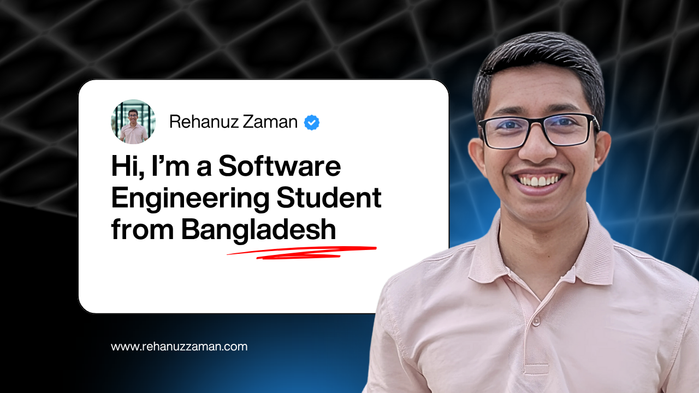

<!-- Banner Image -->

  

<h1 align="center">Hi, I'm Rehan 👋</h1>

<h3 align="center">A Software Engineering Student from Bangladesh 🇧🇩</h3>

  
  
  

  
  
  
  
  
  
  
  
  
  

### 🚀 About Me

- 🔝 Currently working on **Web Projects**
- 🌱 Learning **Full Stack Web Development**
- 👯 Looking to collaborate on **Open Source & Tech Projects**
- 🤝 Seeking guidance on **Advanced JavaScript & Backend Development**
- 👨‍💻 Check out my projects: [GitHub](https://github.com/rehanuzzaman)
- 📝 I write on **Tech & Innovation**: [LinkedIn Newsletter](https://www.linkedin.com/newsletters/daily-tags-trails-7285706490928152576/)
- 💬 Ask me about **C, C++, Arduino, HTML, CSS, Tailwind, Daisy UI**
- 📧 Reach me at **hello@rehanuzzaman.com**
- 🗄 Know more about me: [Portfolio](https://www.rehanuzzaman.com)
- ⚡ Fun fact: **I can write code on pen and paper 😆**

---

### 📊 GitHub Stats:

  

  

  

 

  

---

🚀 Let's build something amazing together!

